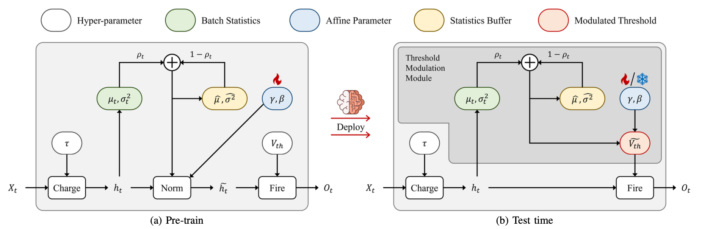

# Threshold Modulation for Online Test-Time Adaptation of Spiking Neural Networks (IJCNN '25)

This repository contains the demo code for the paper [Threshold Modulation for Online Test-time Adaptation of Spiking Neural Networks](https://arxiv.org/abs/2505.05375) 
accepted by IJCNN 2025.
The proposed method Threshold Modulation (TM) is a neuromorphic chip-friendly online test-time adaptation (OTTA) method for spiking neural networks (SNNs) that can adapt to the distribution shift of the input data during inference.


💡 This repository provides a PyTorch implementation of the proposed method TM and the experiments regarding CIFAR-10-C.

💡 This is a re-implementation of part of the work presented in the paper.

## Method Overview


## Results
### CIFAR-10-C with Spiking ResNet-20
| Method   | gaus | shot | impul | defcs | gls  | mtn  | zm   | snw  | frst | fg   | brt  | cnt  | els  | px   | jpg  | Avg. |
|----------|------|------|-------|-------|------|------|------|------|------|------|------|------|------|------|------|------|
| Source   | 72.5 | 66.9 | 71.3  | 48.1  | 56.8 | 43.4 | 38.0 | 28.6 | 37.7 | 33.9 | 11.3 | 76.4 | 29.3 | 59.5 | 27.0 | 46.7 |
| TM-NORM | 34.7 | 31.9 | 40.0  | 17.2  | 39.1 | 19.1 | 16.3 | 25.4 | 24.5 | 20.2 | 11.7 | 18.9 | 26.2 | 24.7 | 27.8 | 25.2 |
| TM-ENT   | **34.5** | **31.1** | **39.7**  | **17.0**  | **38.3** | **18.7** | 16.4 | **25.1** | **24.0** | **20.0** | 11.4 | **18.7** | **25.6** | **24.3** | **26.9** | **24.8** |
| Sourceᵃ  | 73.0 | 67.4 | 69.3  | 49.7  | 61.7 | 43.9 | 40.2 | 31.2 | 42.2 | 34.2 | 11.8 | 78.0 | 30.6 | 59.0 | 28.4 | 48.0 |
| NORMᵃ   | 32.4 | 28.9 | 38.7  | 15.8  | 37.2 | 17.4 | 15.1 | 22.5 | 21.3 | 18.1 | 10.6 | 16.2 | 25.0 | 24.0 | 25.7 | 23.7 |
| TENTᵃ   | 32.1 | 28.9 | 38.7  | 16.0  | 37.0 | 17.4 | 15.1 | 22.4 | 21.4 | 18.0 | 10.6 | 15.6 | 25.1 | 23.6 | 25.5 | 23.2 |

ᵃ model pre-trained without TM; cannot be applied directly in the discussed on-chip scenario.
## Requirements
You can install the dependencies as follows:
```bash
# create a new conda environment
conda create -n tm-otta-snn python=3.11.5
conda activate tm-otta-snn
# clone this repository
git clone https://github.com/NneurotransmitterR/TM-OTTA-SNN.git && cd TM-OTTA-SNN
# install PyTorch
pip install torch==2.1.0 torchvision==0.16.0 torchaudio==2.1.0 --index-url https://download.pytorch.org/whl/cu118
# install other dependencies
pip install -r requirements.txt
# install SpikingJelly
git clone https://github.com/fangwei123456/spikingjelly.git && cd spikingjelly
pip install .

```

## Dataset
The CIFAR-10 and CIFAR-10-C datasets can be downloaded automatically.


## Run experiments on CIFAR-10-C
```bash
bash ./example_cifar.sh
```

## Citation
If you find our work useful, please consider citing our paper:
```bibtex
@misc{zhao2025thresholdmodulationonlinetesttime,
      title={Threshold Modulation for Online Test-Time Adaptation of Spiking Neural Networks}, 
      author={Kejie Zhao and Wenjia Hua and Aiersi Tuerhong and Luziwei Leng and Yuxin Ma and Qinghai Guo},
      year={2025},
      eprint={2505.05375},
      archivePrefix={arXiv},
      primaryClass={cs.CV},
      url={https://arxiv.org/abs/2505.05375}, 
}
```
